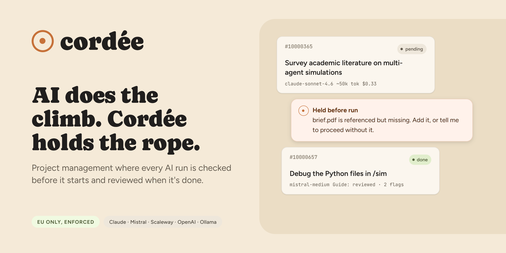
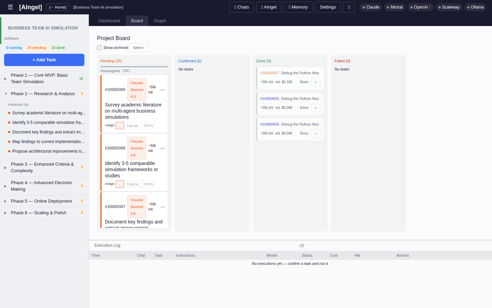
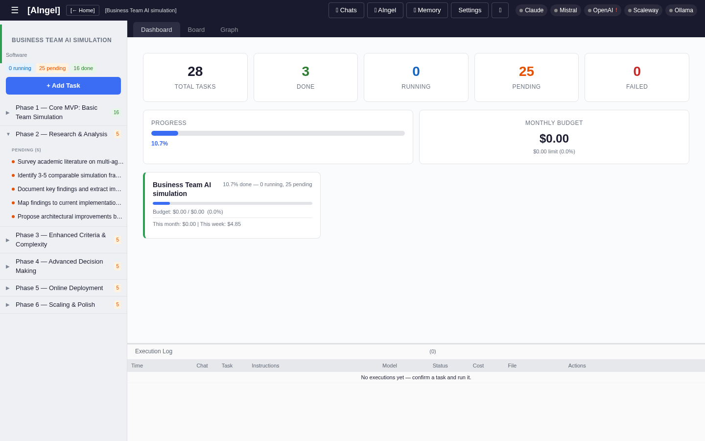
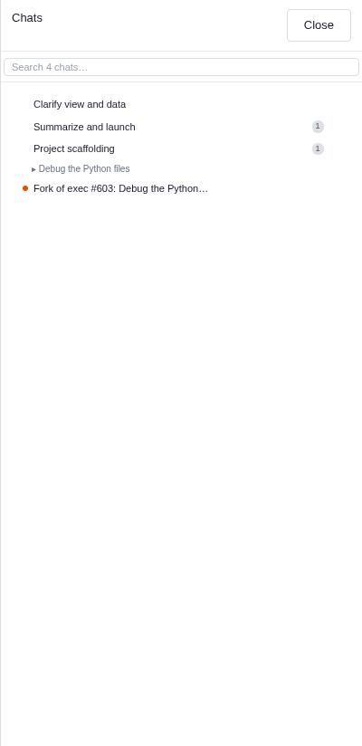
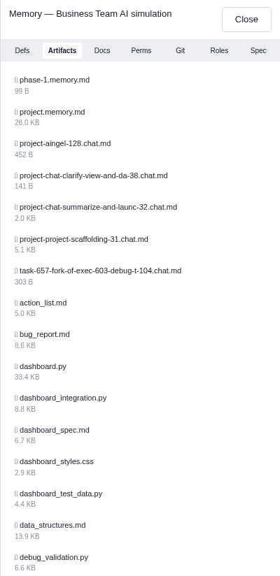
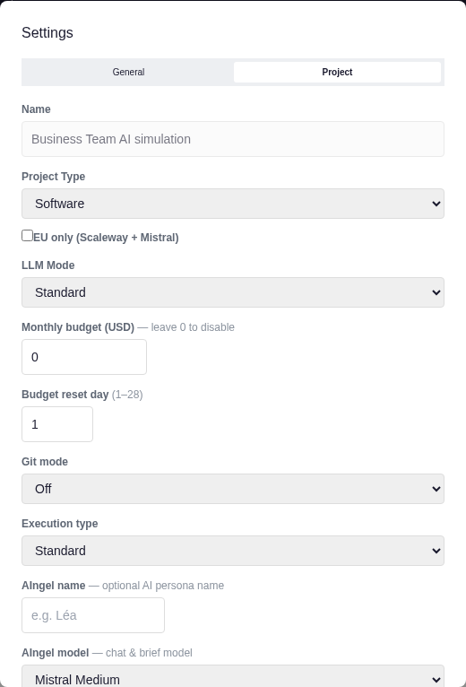
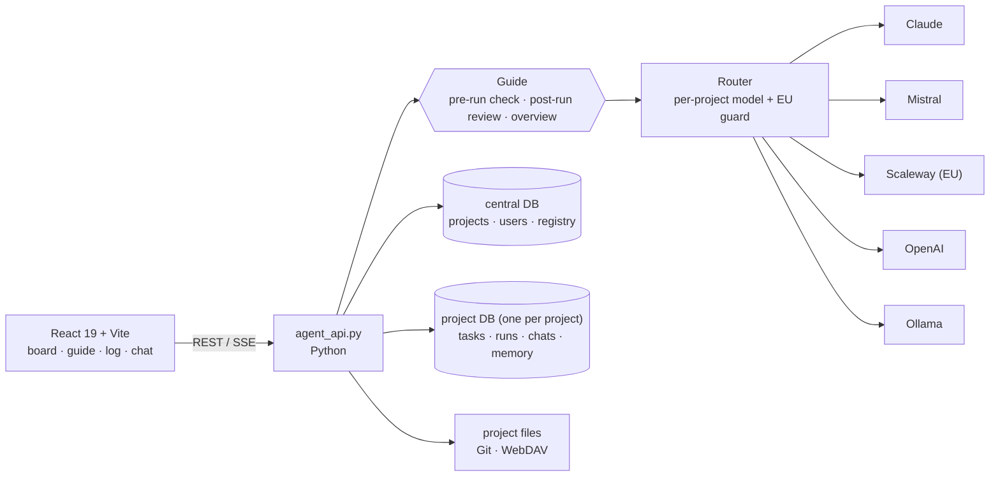

<p align="center">
  
</p>

<p align="center">
  <b>Every AI run is checked before it starts and reviewed when it finishes.</b><br>
  Project management for consultants and small teams who work with AI and can't afford to trust it blindly.
</p>

<p align="center">
  
  
  
  
</p>

---

## Why Cordée

A *cordée* is a rope team: climbers tied together behind a guide who checks every anchor before anyone moves. Cordée applies that idea to AI work.

- **A Guide on every task.** Before a run, the Guide checks that the brief is complete and the inputs exist. After the run, it reviews the output against the brief. It also keeps a running overview of the whole project. Problems get flagged before they reach your client.
- **The right model for each project.** Claude, Mistral, OpenAI, Scaleway or Ollama, chosen per project and per task, not once per installation.
- **EU-only, enforced.** Mark a project `eu_only` and only EU-operated models (Scaleway, Mistral) can run it. The API rejects anything else, so the rule can't be bypassed from the UI.
- **Nothing gets promoted without you.** Phase memory moves into project memory only after you approve it.
- **Spend you can see.** Every run is logged with its tokens and cost. Monthly budgets pause work before you overspend.



## Features

| | |
|---|---|
| **Task board** | Kanban board across phases: pending → confirmed → running → done / failed. AI-assisted drafting, scoping and dependency mapping. |
| **Guide** | Pre-run completeness check, post-run review and a rolling project overview. Runs can be held, retried or reworked. |
| **Execution log** | Every run with status, model, tokens, cost and full output. |
| **Chat** | Context-aware conversation grounded in project and phase memory. |
| **Memory** | Project memory plus per-phase memory, promoted only with your approval. |
| **Execution types** | `standard`, `software` (Git forced on), `research` (full memory), `deployment` (planned). |
| **Files & WebDAV** | Built-in file manager, and project folders can be mounted over WebDAV. |
| **Multi-user** | OIDC login, roles per project (viewer, member, admin, owner) and free-tier quotas. |

<table>
  <tr>
    <td></td>
    <td></td>
  </tr>
  <tr>
    <td></td>
    <td></td>
  </tr>
</table>

## Quick start

**Prerequisites:** Python 3.11+, Node.js 18+, Git

```bash
git clone https://github.com/cordee-app/cordee.git && cd cordee
python3 -m venv venv && source venv/bin/activate
pip install -r requirements.txt
(cd frontend && npm install && npm run build)
cp .env.example .env    # add your provider keys
python3 agent_api.py    # → http://localhost:8001
```

The database is created automatically on first launch.

**Provider CLIs** (used by the default routing modes):
- Anthropic (`ANTHROPIC_MODE=claude-code`): `npm i -g @anthropic-ai/claude-code`
- Mistral (`MISTRAL_MODE=vibe`): install the Vibe CLI, then run `vibe` to log in

**Key environment variables**

```env
AINGEL_PROJECTS_ROOT=/path/to/projects
SCALEWAY_API_KEY=...        # required for EU-only projects
ANTHROPIC_API_KEY=...
MISTRAL_VIBE_KEY=...
```

For systemd, the sandbox and the full variable reference, see [SETUP.md](SETUP.md). To have an AI assistant install and verify everything for you, paste [docs/INSTALL_PROMPT.md](docs/INSTALL_PROMPT.md) into Claude Code, Vibe or Codex.

## Architecture



- **Two databases:** a central DB holds projects, users and the registry. Each project has its own DB with tasks, runs, chats and skills.
- **EU guard:** task creation, model changes and the model recommender all reject non-EU models on `eu_only` projects.
- **Guide hooks:** H2 (pre-run check), H3 (post-run review) and H4 (overview) wrap every execution.

See [READMEFIRST.md](READMEFIRST.md) for the full design.

## Roadmap

- [x] Guide pre-run check, post-run review and overview
- [x] EU-only projects with server-side enforcement
- [x] OIDC login, project roles, free-tier quotas
- [x] WebDAV project mounts
- [ ] Local llama.cpp provider for offline work
- [ ] `deployment` execution type (Scaleway batch pipelines)
- [ ] RAG over project corpora
- [ ] Hosted EU instance

## Development

```bash
python3 -m unittest discover -s tests -p "test_*.py"
cd frontend && npm run test          # Playwright
```

## License

Cordée is dual-licensed:

- **[AGPL-3.0](LICENSE)**: free to use, modify and self-host. If you offer a modified version to users over a network, you must share its source.
- **Commercial license**: no copyleft obligations, with support available. See [docs/COMMERCIAL.md](docs/COMMERCIAL.md).

Contributions are accepted under the [CLA](CLA.md). See [NOTICE](NOTICE) for copyright and third-party notices.

---

<p align="center"><sub>Built for people who work with AI and stay accountable for the result.</sub></p>
